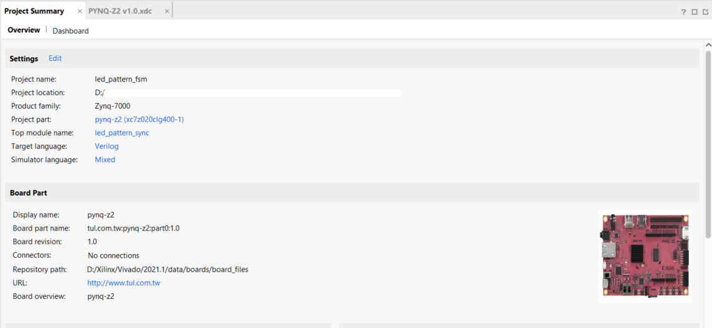

# fpga_fsm_demo
Implementation of synchronous and asynchronous finite-state-machine on FPGA using verilog HDL

<p align="center">
  
</p>

## tree
```
|   PYNQ-Z2 v1.0.xdc
|   README.md
|
+---bitstream
|       led_pattern_async.bit
|       led_pattern_sync.bit
|
+---blink_led_verilog
|       clk_div.v
|       testbench.v
|       top.v
|
+---images
|       design_impl.png
|       fsm_demo_bd.png
|       project_src.png
|       project_summary.png
|       xdc_file.png
|
\---led_pattern_fsm
        clk_div.v
        led_pattern_asnyc.v
        led_pattern_sync.v
```

## Usage
1. Create a new project and add the `led_pattern_sync.v` along with `clk_div.v` and defile `led_pattern_sync.v` as the top module.

<p align="center">
  
  
</p>

2. Modify the `PYNQ-Z2 v1.0.xdc` constraints file according to your IOs in the board([PYNQ-Z2](https://www.xilinx.com/support/university/xup-boards/XUPPYNQ-Z2.html#overview) used here in this example)

<p align="center">
  
</p>

3. Synthezize, Implement and get the bitstream generated. All the IO pin mapping and logic definition is taken care in the `.xdc` file.

<p align="center">
  
</p>

4. Alternatively, you can use the `.bit` file available here directly skipping to this stage.
5. Also, `led_pattern_async.v` can be run the same way along with respecive changes in the `PYNQ-Z2 v1.0.xdc` file based on input and output parameters of the module. This doesn't require `clk_div.v` to be wrapped.

#### Reach out to us at DevHeads community for any support!
